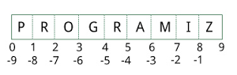

# Data Structures

For full documentation visit [https://docs.python.org/2/tutorial/datastructures.html](https://docs.python.org/2/tutorial/datastructures.html).

Open up either the ipython prompt or an ipython notebook.  Either shall suffice for this.

## Basics - Strings and Numbers
Using numbers in python is pretty straightforward but there is one particular gotcha that is generally a bit weird.  There is no need to associate a particular data type with a variable in python so can reassign variable names as you like.  Try the following

    x = 5
    x =      'hello' # python doesn't care about spaces between stuff but best practise is a single space either side of =.
    y = x 
    x = []
    print x, y

Not very exciting, just an example of how easy it is to reassign a variable.  Lets make x a number again, and y too...  

    x = 9
    y = 6
    x/y # can you guess the answer?

By default Python 2 will give an integer answer to any operation involving integers!  Python 3 behaves more like you'd expect and would give 1.5.  To get the correct answer here you have to make one of your variables a float, to do this

    x = 9.0
    y = 6
    x/y 
    type(x) # type returns the typ of the object.
    type(y) #
    type(x/y)

Hoorah!  Bit of a nuisance in Python 2, something to look out for.  General mathematical stuff looks like this

    x = 10 
    y = 6.0
    x + y
    x - y 
    x * y
    x/y 
    x**5  # x to the power of 5.
    x += 1 # short hand for x = x + 1
    x%y  # this is modulus, x mod y returns the remainder after division of x by y.

[Operator precedence](https://docs.python.org/2/reference/expressions.html#operator-precedence) is in the python docs in more detail.  In general if in doubt use parentheses, e.g.

    (x + y)/(x * y)

Comparison Operators are pretty obvious too, and will return True or False

    x > y 
    x == y
    x != y  # returns True when x and y are not equal.
    x < y
    X >= y # greater than or equal to.
    str(x) # converts the number to a string.

###Booleans
Many functions return a boolean value i.e. True or False.  You can set variables to be booleans too...

    b = True

### Strings

Give the following a try

    s = 'My String'
    t = "My String"
    s == t # These are equivalent.

    u = """My 

    String 

    """
The triple double quoted string means you can use quotes and double quotes in the string and also have a multiline string.

Strings support a number of operations, try

    s = 'My String'
    s.upper()
    s.lower() # note that these don't change s itself, you'd have to assign it for that.
    s = s.lower() # now s will have changed.
    s.capitalize() # capitalizes the first word.
    s.title() # capitalizes all words.
    s + s # concatenation works
    5 * s # strings support multiplication by integer.
    len(s) # returns length of the string.
    s.split(' ') # splits s at the space character.
    s.replace('String', 'Thing') # replaces given characters.

If you're using the ipython prompt you can hit tab after the variable name with a dot and it will list all methods for that object.  Won't work in notebooks.

    s.  # hit tab, not enter, and you will get a list of string methods.

Strings in general can be treated like sequences, that is you can treat each letter separately...

    s[0] # 0 is the first index and returns the first character.
    s[3] # 3 should return the 4th character.
    s[0:3] # all the characters up the 4th.
    s[-1] # you can find letters from the end with negative indexes.
    s[3:0] # doesn't work, slicing only works forward.
    s[0:-5] # does work!  But it starts at 0 and goes forward to the 5th last character.

Check out this indexing image

This gives an idea how indexes work.  So take the zero as being the start before the first letter then think of the s[0:3] slice.  You can now see why you don't get the character s[3] in the slice as it starts at 0 and stops at the 3.  So for s[3] you start at 3 and go forward one character so you get the 4th character.  Don't be fooled by the reverse side s[-1] starts at -1 but again goes forward to get the last charcter not backward.

Finally...

    number_string = '55'
    int(number_string) # converts it to an integer.
